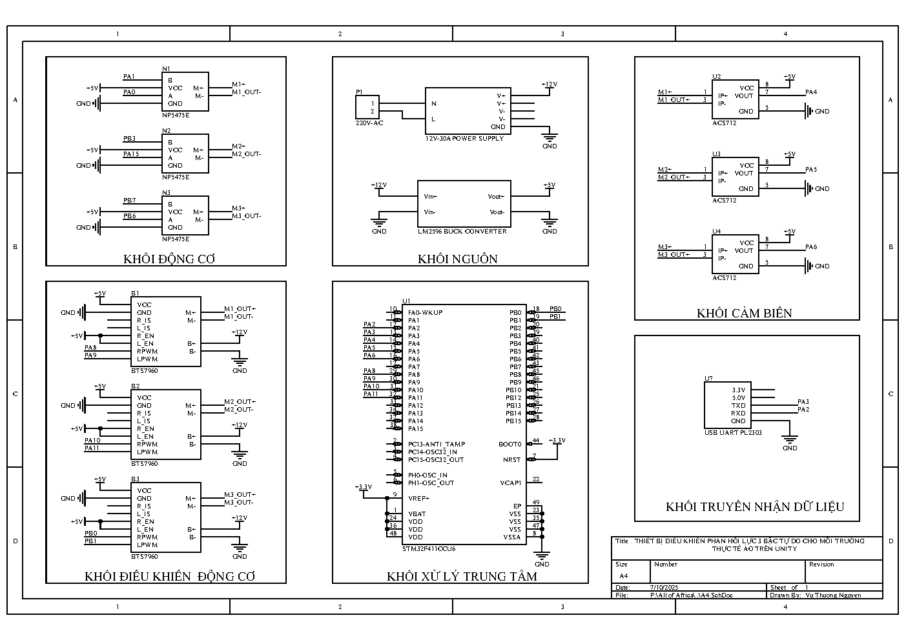

# 🚀 STM32 | HAPTIC FORCE FEEDBACK DEVICE IN UNITY 🤖

Author: **Kaël Shelby** (VTN)  

## 📖 1. Introduction
This project develops a **3-Degrees-of-Freedom (3-DoF) force feedback device** integrated with the Unity virtual reality environment to provide a realistic haptic experience. The system utilizes a **Delta mechanism** with three DC motors (Nisca NF5475, 2.0 A, 12V), controlled by **BTS7960** modules and monitored using **ACS712ELCTR-05B-T** current sensors. The Delta mechanism sends motor angle positions to Unity via UART, controlling an ABB robot arm in the virtual environment. Unity calculates and sends current feedback to simulate haptic forces when the virtual arm encounters obstacles.

  

---

## 🛠️ 2. Hardware Requirements
To build this project, the following components are required:
- **Motors**: 3x Nisca NF5475 DC motors (200 PPR, 2.0 A, 12V).
- **Motor Driver**: BTS7960 (H-Bridge, 43 A, PWM 25 kHz).
- **Current Sensor**: ACS712ELCTR-05B-T (±5 A, galvanic isolation, 185 mV/A sensitivity).
- **Microcontroller**: STM32 (supporting ADC, UART, PWM).
- **USB-to-UART Adapter**: PL2303.
- **Others**: 12V power supply, wiring, capstan joints.

---

## 🔌 3. Circuit Connections
  

---

## 📜 4. User Interface
The ABB robot arm is simulated in the Unity virtual environment.
  

---

## 🎥 5. Demo and Results
👉 [Watch the demo video](https://www.tiktok.com/@kshelbyiot/video/7550532692018728212?is_from_webapp=1&sender_device=pc&web_id=7500959777037518344)

  

## 🚀 6. Setup Instructions
**1. Hardware**
- Connect BTS7960 to motors and STM32 (PWM: IN1, IN2, EN).
- Connect ACS712 to motors and STM32 (ADC for voltage output).
- Establish UART communication between STM32 and Unity.

**2. Software**
- Install **Keil uVision V5** for STM32 programming.
- Install **Unity** (version 2020.3 or later) and import code from `/unity`.

**3. System Execution**
- Upload STM32 code from `/stm32`.
- Run the Unity scene from `/unity`.
- Verify force feedback when the virtual robot arm collides with obstacles in Unity.

## 🚀 7. Future Development
- **Signal Noise Optimization**: Implement advanced filtering algorithms (e.g., Kalman filter) to enhance ACS712 accuracy.
- **Extended DoF**: Upgrade the Delta mechanism to 6-DoF for more complex motion simulation in Unity.
- **AI Integration**: Use AI to dynamically adjust force feedback based on user interactions in VR.
- **Applications**: Develop use cases such as surgical simulation, robotic training, or VR gaming with haptic feedback.

